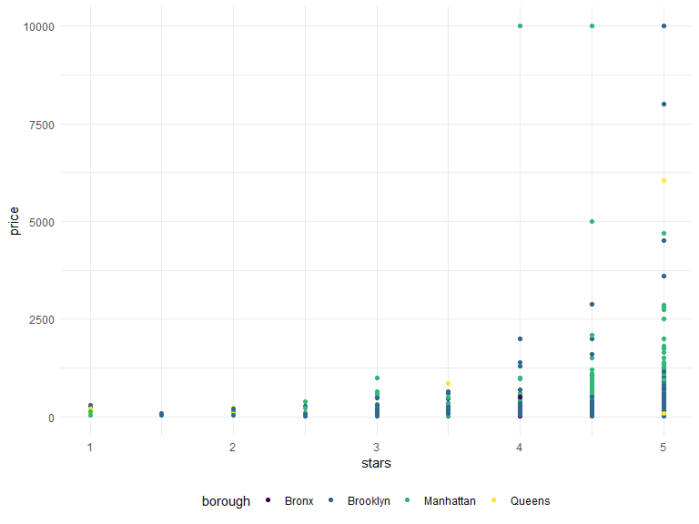

Linear Models
================
Suning Zhao
2022-12-03

## Import data.

``` r
data("nyc_airbnb")

nyc_airbnb = 
  nyc_airbnb %>% 
  mutate(stars = review_scores_location / 2) %>% 
  rename(
    borough = neighbourhood_group,
    neighborhood = neighbourhood) %>% 
  filter(borough != "Staten Island") %>% 
  select(price, stars, borough, neighborhood, room_type)
```

## Fit a model

``` r
nyc_airbnb %>% 
  ggplot(aes(x = stars, y = price, color = borough))+
  geom_point()
```



Let’s fit the model we care about.

``` r
fit = lm(price ~ stars + borough, data = nyc_airbnb)
```

Let’s look at the result…

``` r
fit
```

    ## 
    ## Call:
    ## lm(formula = price ~ stars + borough, data = nyc_airbnb)
    ## 
    ## Coefficients:
    ##      (Intercept)             stars   boroughBrooklyn  boroughManhattan  
    ##           -70.41             31.99             40.50             90.25  
    ##    boroughQueens  
    ##            13.21

``` r
summary(fit)
```

    ## 
    ## Call:
    ## lm(formula = price ~ stars + borough, data = nyc_airbnb)
    ## 
    ## Residuals:
    ##    Min     1Q Median     3Q    Max 
    ## -169.8  -64.0  -29.0   20.2 9870.0 
    ## 
    ## Coefficients:
    ##                  Estimate Std. Error t value Pr(>|t|)    
    ## (Intercept)       -70.414     14.021  -5.022 5.14e-07 ***
    ## stars              31.990      2.527  12.657  < 2e-16 ***
    ## boroughBrooklyn    40.500      8.559   4.732 2.23e-06 ***
    ## boroughManhattan   90.254      8.567  10.534  < 2e-16 ***
    ## boroughQueens      13.206      9.065   1.457    0.145    
    ## ---
    ## Signif. codes:  0 '***' 0.001 '**' 0.01 '*' 0.05 '.' 0.1 ' ' 1
    ## 
    ## Residual standard error: 181.5 on 30525 degrees of freedom
    ##   (9962 observations deleted due to missingness)
    ## Multiple R-squared:  0.03423,    Adjusted R-squared:  0.03411 
    ## F-statistic: 270.5 on 4 and 30525 DF,  p-value: < 2.2e-16

``` r
summary(fit)$coef
```

    ##                   Estimate Std. Error   t value     Pr(>|t|)
    ## (Intercept)      -70.41446  14.020697 -5.022180 5.137589e-07
    ## stars             31.98989   2.527500 12.656733 1.269392e-36
    ## boroughBrooklyn   40.50030   8.558724  4.732049 2.232595e-06
    ## boroughManhattan  90.25393   8.567490 10.534465 6.638618e-26
    ## boroughQueens     13.20617   9.064879  1.456850 1.451682e-01

``` r
coef(fit)
```

    ##      (Intercept)            stars  boroughBrooklyn boroughManhattan 
    ##        -70.41446         31.98989         40.50030         90.25393 
    ##    boroughQueens 
    ##         13.20617

Let’s look at the result better

``` r
broom::glance(fit)
```

    ## # A tibble: 1 × 12
    ##   r.squared adj.r.…¹ sigma stati…²   p.value    df  logLik    AIC    BIC devia…³
    ##       <dbl>    <dbl> <dbl>   <dbl>     <dbl> <dbl>   <dbl>  <dbl>  <dbl>   <dbl>
    ## 1    0.0342   0.0341  182.    271. 6.73e-229     4 -2.02e5 4.04e5 4.04e5  1.01e9
    ## # … with 2 more variables: df.residual <int>, nobs <int>, and abbreviated
    ## #   variable names ¹​adj.r.squared, ²​statistic, ³​deviance
    ## # ℹ Use `colnames()` to see all variable names

``` r
broom::tidy(fit) %>% 
  select(-std.error, -statistic) %>% 
  mutate(
    term = str_replace(term, "borough", "Borough:")
  ) %>% 
  knitr::kable()
```

| term              |  estimate |   p.value |
|:------------------|----------:|----------:|
| (Intercept)       | -70.41446 | 0.0000005 |
| stars             |  31.98989 | 0.0000000 |
| Borough:Brooklyn  |  40.50030 | 0.0000022 |
| Borough:Manhattan |  90.25393 | 0.0000000 |
| Borough:Queens    |  13.20617 | 0.1451682 |
